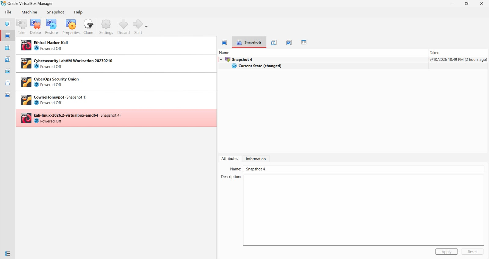

# NETWORKWALKS-Ahmed-B083-WK1-PM1-CYBERSECURITY-LAB-SETUP
An Isolated virtual Kali Linux lab for cybersecurity testing and penetration testing practice.
<div align="center">

#  Cybersecurity Lab Environment Setup

**Building an isolated virtual lab for penetration testing and ethical hacking practice**
</div>

<p align="center">
  
  
  
  
  
  
  
  
  
  
  
  
</p>

---

## Project Overview:

This project is about creating a **virtual cybersecurity and penetration-testing lab** using VirtualBox and Kali Linux.

The aim is to build a safe and controlled environment where cybersecurity tools can be used for tasks such as network scanning, reconnaissance, and vulnerability testing.

The lab uses a private virtual network, allowing other machines to be added later as targets for **authorized security testing**.


---


##  Objectives:

The main objectives:

- Install and configure VirtualBox.
- Install and import Kali Linux as a virtual machine.
- Create a private **NAT Network** for the cybersecurity lab.
- Configure network connectivity for Kali Linux.
- Assign a consistent IP address to the Kali VM.
- Verify network connectivity and DNS resolution.
- Take a snapshot for recovery.
- Document the complete setup process.

---

##  Purpose of the Lab:

The lab creates a safe and separate environment for learning cybersecurity and carrying out authorized security tests.

It can be used for tasks such as:

* Network discovery
* Port scanning
* Finding security weaknesses
* Analyzing network traffic
* Testing web applications
* Practicing exploitation techniques
* Trying out different security tools

---


## Lab Configuration:

|  Component       |  Configuration   |
| ------------------ | ------------------  |
|  Host OS         | Windows 11         |
|  Host RAM        | 8 GB               |
|  Processor       | Intel Core i5      |
|  Hypervisor      | VirtualBox         |
|  Security OS     | Kali Linux 2026.2  |
|  Kali RAM        | 4096 MB            |
|  Virtual Network | NAT Network        |
|  Network Address | 10.0.0.0/24        |
|  Kali IP Address | 10.0.0.2/24        |
|  Default Gateway | 10.0.0.1           |
|  DNS Server      | 8.8.8.8            |
|  Future VM Range | 10.0.0.3–10.0.0.99 |

---

# Lab Setup Step by Step:

## Step 1 Install 7-Zip:

Installed 7-Zip to extract Kali file

**Tool:** 7-Zip

---

## Step 2 Install VirtualBox:

VirtualBox was installed as the hypervisor.

---

## Step 3 Create a NAT Network:

A dedicated NAT Network was created in VirtualBox.

Configuration:
Network Name: NatNetwork
IPv4 Prefix:  10.0.0.0/24
DHCP:         Enabled
IPv6:         Disabled


A NAT Network was chosen so that multiple virtual machines can connect to the same network and communicate with each other while still having internet access.

This setup also makes it possible to add attacker and target VMs later for testing within the lab.


---

## Step 4 Import Kali Linux:

The Kali Linux virtual machine was downloaded from the official Kali Linux website and then imported into VirtualBox.

The VM network adapter was configured as follows:

```text
Adapter 1
Attached to: NAT Network
Network:     NatNetwork
```

The VM was allocated:

```text
RAM: 4096 MB
```

A shared folder was also configured for transferring required files between the host operating system and the Kali VM.


---

## Step 5 Configure the Kali Linux Network:

The Kali Linux network configuration was checked and configured with a consistent IPv4 address.

Example configuration:

```text
IP Address: 10.0.0.2
Subnet Mask: 255.255.255.0
Gateway: 10.0.0.1
DNS: 8.8.8.8
```


---

## Step 6 Create a Clean VM Snapshot:




A snapshot shows the clean starting state of the lab.

If any future testing changes or breaks the VM, it can be restored to this saved state.


---

# Lab Verification:

|   Test                        |  Command                      | Expected Result              |
| ----------------------------- | ------------------------------- | ------------------------------- |
|  Check IP address           | `ip a`                          |10.0.0.2/24      |
|  Test gateway               | `ping 10.0.0.1`                 | 10.0.0.1              |
|  Test Internet connectivity | `ping 8.8.8.8`                  | google was loaded              |
|  Test DNS resolution        | `nslookup networkwalks.com`     | 8.8.8.8                 |
|  Verify Nmap                | `nmap --version`                | Nmap version displayed          |
|  Verify snapshot            | Restore snapshot and run `ip a` | Baseline configuration restored |

### Example Results

```text
IP Address:
10.0.0.2/24

Gateway:
10.0.0.1

DNS:
8.8.8.8
```

---

# What I Learned:

Through this project, I learned how to build and configure a virtual environment for cybersecurity practice.

The main things I learned were:

1. NAT vs NAT Network

I learned that NAT and NAT Network work differently.

A NAT Network allows multiple VMs to communicate with each other while still providing internet access which makes it useful for creating a cybersecurity lab with multiple machines.


2. Static IP Configuration

I learned how to set up and check IP addresses, subnet masks, gateways, and DNS settings in Kali Linux.

3. VM Snapshots

I learned that creating a clean snapshot before testing is important. It provides a safe restore point if something goes wrong during future experiments.

4. Documentation

I learned that keeping clear records of commands, settings, screenshots, problems, and solutions is an important part of cybersecurity work.

---


# 🔗 Tools & Resources

- **7-Zip:** [https://7-zip.org/download.html](https://7-zip.org/download.html)
- **VirtualBox:** [https://virtualbox.org/wiki/Downloads](https://virtualbox.org/wiki/Downloads)
- **Kali Linux:** [https://kali.org/get-kali](https://kali.org/get-kali)

---

# 👤 Author

**Ahmed Ayman Abdelhalim Moustafa Ahmed**\
Cybersecurity Professional B083-C

LinkedIn: [https://www.linkedin.com/in/ahmed-ayman-ahmed-a56364344?utm_source=share_via&utm_content=profile&utm_medium=member_android)

---

## 📌 Project Information

**Program Name:** Cybersecurity at Networkwalks | **Week:** 01
